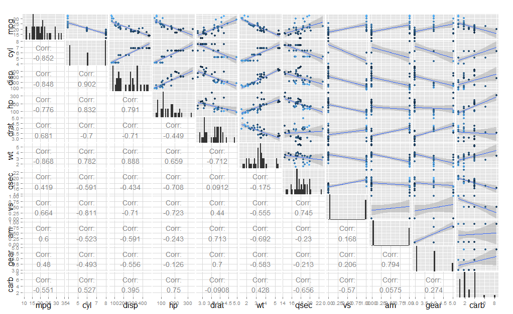

# Introduction
We will first do exploratory data analysis to find some relationship between the variables.

Then we will fit several linear models and analyse the quality of prediction, choose the best one and find the confidence interval for the predictor _am_.

# Exploratory Data Analysis
The [pair plots](#pairs) show that _mpg_ has a strong correlation ($> 0.8$) with _cyl_, _disp_ and _wt_.  The correlation between _mpg_ and _am_ is only 0.6 which is not very significant, and also _am_ has stronger correlation with _wt_ and _drat_, indicating that _am_ could be confounded by _wt_ and _drat_.

The [box plot](#box) shows that there is a difference between the distribution of _mpg_ for different _am_ value.

Another [plot](#confounder) shows _mpg_ by _am_ treating _cyl_ as confounder.  It seems _mpg_ and _am_ are positively correlated in each _cyl_ level.

# Regression Analysis
First fit a model with all predictors except _am_.
```{r}
lm_fit_no_am <- lm(mpg ~ . - am, data = mtcars)
```
```
summary(lm_fit_no_am)

...
Residuals:
    Min      1Q  Median      3Q     Max 
-2.9886 -1.6738 -0.3834  0.9796  5.4395 
...
Residual standard error: 2.68 on 22 degrees of freedom
Multiple R-squared:  0.8596,  Adjusted R-squared:  0.8022 
F-statistic: 14.97 on 9 and 22 DF,  p-value: 1.855e-07
```

Then fit a linear model with all predictors.
```{r}
lm_fit <- lm(mpg ~ ., data = mtcars)
```
```
summary(lm_fit)

...
Residuals:
    Min      1Q  Median      3Q     Max 
-3.4506 -1.6044 -0.1196  1.2193  4.6271 

Coefficients:
            Estimate Std. Error t value Pr(>|t|)  
...
am           2.52023    2.05665   1.225   0.2340  
...
Residual standard error: 2.65 on 21 degrees of freedom
Multiple R-squared:  0.869,  Adjusted R-squared:  0.8066 
F-statistic: 13.93 on 10 and 21 DF,  p-value: 3.793e-07
```
Note p-value(_am_) = 0.2340 `>>` 0.05, indicating that _am_ is unlikely to be significant in predicting _mpg_.

And [here](#lm_reg) is the residual plot of the two models (ignore the third one for now), and a [QQ plot](#qq) shows that the residuals almost follow a normal distribution.

Performing anova on lm_fit_no_am and lm_fit, 
```{r, eval=F}
anova(lm_fit_no_am, lm_fit)
## ...
##   Res.Df    RSS Df Sum of Sq      F Pr(>F)
## 1     22 158.04                           
## 2     21 147.49  1    10.547 1.5016  0.234
```
The F-value for lm_fit compared to lm_fit_no_am is 0.234 `>>` 0.05, indicating that _am_ does not have strong influence on _mpg_.

Next, find the VIF of the predictors of lm_fit, 
```{r}
library(car)
vif(lm_fit)
```

Finally, fit another model by taking out the top two predictors with VIF > 10.

```{r}
lm_fit_adj_vif <- lm(mpg ~ . - disp - cyl, data = mtcars)
```
```
summary(lm_fit_adj_vif)

Coefficients:
            Estimate Std. Error t value Pr(>|t|)  
... 
am           2.42418    1.91227   1.268   0.2176  
...
Residual standard error: 2.566 on 23 degrees of freedom
Multiple R-squared:  0.8655,  Adjusted R-squared:  0.8187 
F-statistic:  18.5 on 8 and 23 DF,  p-value: 2.627e-08
```

We use the model with the highest adjusted r-squared value, i.e., lm_fit_adj_vif.

Assuming coef(_am_) follows a t-distribution, its $\alpha$ confidence interval is $[\hat{\Theta} - z\sigma, \hat{\Theta} + z\sigma]$, where $\hat{\Theta} = \text{estimate mean} = 2.42418$, $\sigma = \text{standard error} = 1.91227$, $z = \Pr(t < {\alpha \over 2})$, and the degree of freedom is 23.  For $\alpha = 0.05$, the interval is $[1.449181, 3.399179]$.

Overall, manual transmission seems to have a higher MPG on average, about 2.42mpg, with 95% confidence interval $[1.449181, 3.399179]$.

# Appendix
### Pair plot of features {#pairs}
* Lighter color means higher mpg

```{r, eval=F, echo=F}
library(GGally)
data(mtcars)
pairs1 <- ggpairs(data = mtcars, upper = list(continuous = "blank", combo = "blank", discrete = "blank"), lower = list(continuous = "cor", combo = "blank", discrete = "blank"), diag = list(continuous = "bar", discrete = "bar"))

pairs2 <- ggpairs(data = mtcars, upper = list(continuous = "smooth", combo = "blank", discrete = "blank"), lower = list(continuous = "blank", combo = "blank", discrete = "blank"), diag = list(continuous = "blank", discrete = "blank"), color = "mpg")

# Overlay the two plots
p <- dim(mtcars)[2]
for (i in 1:p) {
  j <- 1
  while(j <= i) {
    pairs2 <- putPlot(pairs2, getPlot(pairs1, i, j), i, j)
    j <- j + 1
  }
}

print(pairs2)
```


### Box plot of MPG and Transmission {#box}
* `----` marks the mean

```{r, echo=F}
library(ggplot2)
ggplot(data = mtcars, aes(x = factor(am, levels = c(0, 1), labels = c("auto", "manual")), y = mpg)) + 
  geom_boxplot() + 
  geom_jitter(aes(color = mpg, size = 3)) + 
  stat_summary(fun.y = "mean", geom = "text", label="----", size= 10, color= "black") +
  guides(size = F) + # Turn off legend for size
  xlab("am") +
  ggtitle("MPG by Transmission")
```

### MPG by Transmission across Number of Cylinders {#confounder}
```{r, echo=F}
library(ggplot2)
ggplot(data = mtcars, aes(x = am, y = mpg, color = factor(cyl))) +
  geom_point(aes(alpha = 0.5, size = 3)) +
  stat_smooth(method = glm) +
  guides(alpha = F, size = F)
```

### Linear Regression Residual Plot {#lm_reg}
```{r, echo=F}
library(ggplot2)
lm_resid_df <- data.frame(x = 1:dim(mtcars)[1], lm_fit_no_am = resid(lm_fit_no_am), lm_fit = resid(lm_fit), lm_fit_adj_vif = resid(lm_fit_adj_vif))
ggplot(data = lm_resid_df) +
  geom_boxplot(aes(x = "lm_fit_no_am", y = lm_fit_no_am, color = "lm_fit_no_am")) +
  geom_boxplot(aes(x = "lm_fit", y = lm_fit, color = "lm_fit")) +
  geom_boxplot(aes(x = "lm_fit_adj_vif", y = lm_fit_adj_vif, color = "lm_fit_adj_vif")) +
  geom_jitter(aes(x = "lm_fit_no_am", y = lm_fit_no_am, color = "lm_fit_no_am")) +
  geom_jitter(aes(x = "lm_fit", y = lm_fit, color = "lm_fit")) +
  geom_jitter(aes(x = "lm_fit_adj_vif", y = lm_fit_adj_vif, color = "lm_fit_adj_vif")) +
  scale_x_discrete(limits = c("lm_fit_no_am", "lm_fit", "lm_fit_adj_vif")) +
  xlab("model") +
  ylab("residual") +
  theme(legend.position="none")
```

### QQ Plot for Residuals {#qq}
```{r, echo=F}
library(car)
par( mfrow = c( 1, 3 ), pty = "s")
qqPlot(lm_fit_no_am, main = "lm_fit_no_am", xlab = "", ylab = "")
qqPlot(lm_fit, main = "lm_fit", xlab = "", ylab = "")
qqPlot(lm_fit_adj_vif, main = "lm_fit_adj_vif", xlab = "", ylab = "")
```